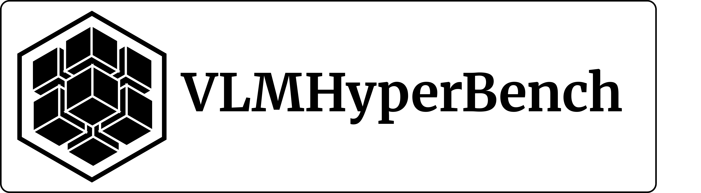

# Проект VLMHyperBench

`VLMHyperBench` — open source фреймворк для оценки возможностей `Vision language models(VLM)` распознавать документы на русском языке с целью оценки их потенциала для автоматизации документооборота.

## Цели проекта
1. Дать исследователям удобный инструмент для оценки VLM.
2. Дать инженерам удобный инструмент для оценки VLM при их запуске на фреймворках инференса используемым в `production`(`vLLM`, `SGLang`).
3. Упростить и ускорить внедрение самых передовых технологий из мира `Deep Learning` в контуры компаний.

## Актуальность
Сейчас для обработки каждого нового документа со своей структурой разрабатываются специальные решения с использованием подходов `Optical character recognition (OCR)`.

Используя `VLM`, можно заменить разработку нового узкоспециализированного решения под новую структуру документа на подбор подходящего промпта для извлечения нужных данных из сканов документов. 

В настоящее время область мультимодальных моделей интенсивно развивается: появляются новые модели и фреймворки для инференса моделей, — в связи с этим инструменты, позволяющие производить объективное сравнение моделей по метрикам, потребляемым ресурсам и скорости инференса на наборах данных компании/исследователей, востребованы как никогда.

## Ключевые особенности
Разрабатываемый фреймворк `VLMHyperBench` позволяет запускать каждую VLM в своем собственном изолированном окружении (сейчас изоляция осуществляется с помощью `Docker-контейнеров`).

### Фреймворк позволяет
* Сравнивать между собой модели несовместимые по зависимостям.
* Сравнивать модели запускаемые на разных фреймворках инференса (`Hugging Face`, `vLLM`, `SGLang`)
* Автоматизировать тестирование `Docker-контейнеров` с VLM моделями в CI/CD-пайплайнах компаний.
* Оценивать подбираемые промпты для каждого отдельного типа документа и каждого отдельного поля документа.
* Использовать разные коллекции промптов и системных промптов подобранных индивидуально для каждой модели на одном и том же датасете благодаря компонентам `PromptAdapter` и `TXTPromptAdapter` ([ссылка](https://github.com/VLMHyperBenchTeam/prompt_adapter))

### Особенности
* Является `open source` инструментом (с лицензией разрешающей коммерческое использование), рассчитанным на исследователей и инженеров.
* Обладает модульной архитектурой для легкого добавления дополнительных наборов данных, моделей, метрик и визуализаций результатов оценки.
* Модульность: 
    1. Все компоненты — `python-пакеты`. Мы хотим, чтобы Вы могли использовать их в Ваших проектах, связанных с VLM, независимо от нашего основного проекта.
    2. Docker-контейнеры `VLMHyperBench` также опубликованы и доступны для свободного скачивания и использования в Ваших проектах.

## Материалы по проекту
* Сайт с документаций проекта ([ссылка](https://vlmhyperbenchteam.github.io/VLMHyperBenchDocs/))
* GitHub организации VLMHyperBenchTeam ([ссылка](https://github.com/orgs/VLMHyperBenchTeam/repositories))
* Container registry с нашими Docker-образами VLMHyperBenchTeam ([ссылка](https://github.com/orgs/VLMHyperBenchTeam/packages))

## Этапы работы VLMHyperBench
Процесс оценки моделей состоит из 4-х этапов:

### 1. Этап "Планирование задач"

На данном этапе необходимо сформировать csv-файла со списком задач.

Одна задача — один `Evaluation run`.

Понятие `Evaluation run` включает в себя выбор:
* датасета, на котором будет оцениваться модель;
* фреймворка для инференса модели (`Hugging Face`, `vLLM`, `SGLang`);
* модели VLM (например, `Qwen2.5-VL-3B`);
* `коллекции промптов` для VLM (опционально);
* `системного промпта` для VLM (опционально);
* `ML-метрик`, которыми необходимо оценить ответы от VLM (опционально)

ПО считывает из csv-файла от пользователя набор всех `Evaluation run`, которые далее распределяются по исполнителям (сейчас `VLMHyperBench` запускается на ПК с поддержкой 1-го GPU и может выполнять только 1 задачу).

### 2. Этап "Запуск VLM"

Используя указанные параметры в `Evaluation run`, ПО:

* скачивает из нашего `Container Registry` ([ссылка](https://github.com/orgs/VLMHyperBenchTeam/packages)) Docker-образ (с поддержкой вычислений на GPU) для выбранной VLM с настроенным внутри рабочим окружением для модели;
* поднимает `Docker-контейнер` с VLM;
* загружает указанный датасет;
* загружает указанную `коллекцию промптов` для VLM;
* загружает указанный `системный промпт` для VLM;
* инициализирует VLM;
* осуществляет итерирование по датасету
* и сохраняет ответы модели в csv-файл.

> [!NOTE]
>
> Данный этап опционален и может не выполняться, если требуется произвести только оценку ответов модели на новых метриках.

### 3. Этап "Оценка метрик"

Используя указанные параметры в `Evaluation run`, ПО:

* скачивает из нашего `Container Registry` ([ссылка](https://github.com/orgs/VLMHyperBenchTeam/packages)) Docker-образ(с поддержкой вычислений на CPU) для нашего `MetricEvaluator` с настроенным внутри рабочим окружением;
* считывает исходный датасет;
* считывает ответы модели;
* производит расчет указанных метрик
* и сохраняет полученные метрики в csv-файл.

> [!NOTE]
>
> Данный этап опционален и может не выполняться, если требуется получить только ответы от модели без расчета метрик.

### 4. Этап "Генерация отчета с диаграммами" (в разработке)

Мы хотим формировать отчеты с важными для исследователей и инженеров: 
* ML-метриками;
* параметрами работы моделей (время инференса, потребляемые ресурсы)
* и диаграммами.

> [!NOTE]
>
> В настоящий момент мы собираем обратную связь о том, что должно войти в подобный отчет.

В планах разработать отдельный модуль, который будет создавать эти отчеты по результатам, полученным на каждом `Evaluation run`.

## Планы на будущее

* Добавить поддержку изоляции окружения для VLM на уровне `python venv`.

    1. Изоляция окружения для VLM с помощью `Docker` требует `root` прав на его использование. Не везде есть такая возможность.
    2. Хочется иметь возможность работы самого `VLMHyperBench` внутри `Docker-контейнера`. 

Многие облачные провайдеры предлагают запуск `Docker-контейнера` на своих облачных GPU. При этом возможность запуска `Docker-контейнеров in Docker` заблокирована по соображениям безопасности.

Возможность использования изоляции окружения для запуска VLM на уровне `python venv` потенциально позволяет решить эти проблемы.

* Добавить поддержку системы контейнеризации `Singularity` в качестве способа изоляции окружения моделей.

`Singularity` популярна на GPU-кластерах IT-компаний и университетов.

* Добавить поддержку работы с удаленными `pod` на `RunPod` ([ссылка](https://www.runpod.io/)) для запуска моделей.

Данный облачный провайдер предлагает недорогую аренду облачных GPU. 
Мы надеемся, что данный кейс будет полезен небольшим исследовательским группам или инженерам небольших компаний и стартапов.

