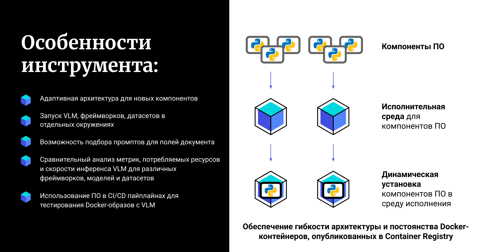
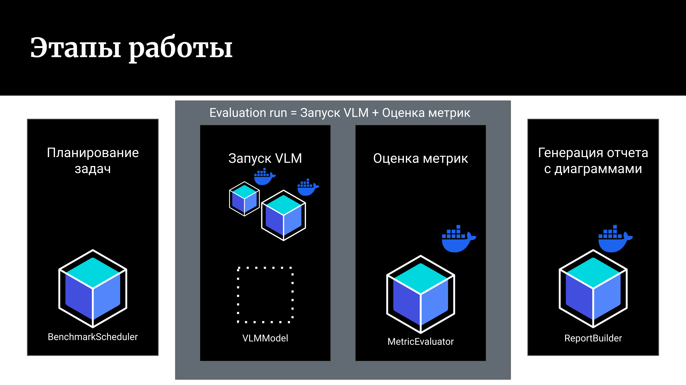

# Проект VLMHyperBench

`VLMHyperBench` – open source фреймворк для оценки возможностей `Vision language models(VLM)` распознавать документы на русском языке с целью оценки их потенциала для автоматизации документооборота.

## Цели проекта:
1. Дать исследователям удобный инструмент для оценки VLM
2. Дать инженерам удобный инструмент для оценки VLM при их запуске на фреймворках инференса используемым в `production`(`vLLM`, `SGLang`).
3. Упростить и ускорить внедрение самых передовых технологий из мира `Deep Learning` в контуры компаний

## Актуальность
Сейчас для обработки каждого нового документа со своей структурой разрабатываются специальные решения с использованием подходов `Optical character recognition (OCR)`.

Используя `VLM` можно заменить разработку нового узкоспециализированого решения под новую структуру документа на подбор подходящего промпта для извлечения нужных данных из сканов документов. 

В настоящее время область мульти-модальных моделей интенсивно развивается: появляются новые модели, фреймворки для инференса моделей и востребованы инструменты, которые позволять производить объективное сравнение моделей по метрикам, потребляемым ресурсам и скорости инференса на наборах данных компании/исследователей.

## Ключевые особенности
Разрабатываемый фреймворк `VLMHyperBench` позволяет запускать каждую VLM в своем собственном изолированном окружении(сейчас изоляция осуществляется с помощью `Docker-контейнеров`).

`VLMHyperBench` позволяет:
* сравнивать между собой модели несовместимые по зависимостям
* сравнивать модели запускаемые на разных фреймворках инференса(`Hugging Face`, `vLLM`, `SGLang`)
* автоматизировать тестирование `Docker-контейнеров` с VLM моделями в CI/CD пайплайнах компаний
* оценивать подбираемые промпты для каждого отдельного типа документа и каждого отдельного поля документа
* использовать разные коллекции промптов для разных моделей на одном и том же датасете благодаря компонентам `PromptAdapter` и `TXTPromptAdapter`([ссылка](https://github.com/VLMHyperBenchTeam/prompt_adapter))

Разрабатываемое ПО будет являться open source инструментом, рассчитанными на инженеров ит компаний, и на исследователей.

Проект придерживается модульной архитектуры для легкого добавления своих наборов данных, VLM, метрик и визуализаций результатов оценки.

Все компоненты `VLMHyperBecnh` это отдельные `python-пакеты`, - мы хотим, чтобы Вы могли использовать их в Ваших проектах связанных с VLM, независимо от нашего основного проекта.

Docker-контейнеры `VLMHyperBecnh` так же опубликованы для свободного скачивания и использования в Ваших проектах.

## Материалы по проекту:
* Сайт с документаций проекта ([ссылка](https://vlmhyperbenchteam.github.io/VLMHyperBenchDocs/))
* GitHub организации VLMHyperBenchTeam ([ссылка](https://github.com/orgs/VLMHyperBenchTeam/repositories))
* Container registry с нашими Docker-образами VLMHyperBenchTeam ([ссылка](https://github.com/orgs/VLMHyperBenchTeam/packages))

## Этапы работы оценки моделей
Процесс оценки моделей состоит из 4 этапов:

### 1. Этап `Планирование задач` - ПО считывает из csv-файла от пользователя набор `Evaluation run`.

Понятие `Evaluation run` включает в себя выбор:
* датасета на котором будет оцениваться модель.
* фреймворка для инференса модели (`Hugging Face`, `vLLM`, `SGLang`).
* модели VLM (например, `Qwen2.5-VL-3B`).
* `коллекции промптов` для VLM (опционально)
* `cистемного промпта` для VLM (опционально)
* `ML-метрик`, которые хотим оценить по ответам от VLM (опционально)

На этом этапе будет сформирован список `Evaluation run`.

`Evaluation run` будут распределены по исполнителям (сейчас 1 задача запускается на 1 GPU на ПК на котором запущен `VLMHyperBecnh`).

### 2. Этап `Запуск VLM` - ПО используя указанные параметры в `Evaluation run`:

* скачивает из нашего `Container Registry`([ссылка](https://github.com/orgs/VLMHyperBenchTeam/packages)) Docker-образ(с поддержкой вычислений на GPU) для выбранной VLM, внутри которого настроено рабочее окружение для ее работы
* поднимает `Docker-контейнер` с VLM
* загружает указанный датасет
* загружает указанную `коллекцию промптов` для VLM
* загружает указанный `cистемный промпт` для VLM
* инициализирует VLM
* осуществляет итерирование по датасету
* и сохраняет ответы модели в csv-файл

Данный `этап опционален` и может не выполняться.

Например, у нас уже есть ответы от модели, и мы без ее запуска хотим оценить новые метрики по ее ответам, которые не оценивали ранее при ее запуске.

### 3. Этап `Оценка метрик` - ПО используя указанные параметры в `Evaluation run`:

* скачивает из нашего `Container Registry`([ссылка](https://github.com/orgs/VLMHyperBenchTeam/packages)) Docker-образ(с поддержкой вычислений на CPU) для нашего `MetricEvaluator`, внутри которого настроено рабочее окружение для его работы
* считывает исходный датасет
* считывает ответы модели
* производит расчет указанных метрик
* и сохраняет полученные метрики в csv-файл

Данный `этап опционален` и может не выполняться.

Например, мы хотим только получить ответы от модели, а оценку метрик хотим сделать позже.

### 4. Этап `Генерация отчета с диаграммами` (в разработке)

Мы хотим формировать отчеты с важными для исследователей и инженеров: ML-метриками, параметрами моделей(время инференса, потребляемые ресурсы) и диаграммами.

В настоящий момент мы собираем обратную связь о том, что должно войти в подобный отчет.

В планах разработать отдельный модуль, который будет создавать эти отчеты по результатам полученным на `Evaluation run`

## Планы на будущее:
* Добавить поддержку изоляции окружения для VLM на уровне `python venv`.
Изоляция окружения для VLM с помощью `Docker` требует `root` прав на его использование не везде есть такая возможность.

Так же хочется иметь возможность работы самого `VLMHyperBecnh` внутри `Docker-контейнера`.

Многие облачные провайдеры предлагают запуск `Docker-контейнера` на своих облачных GPU.

При этом возможность запуска `Docker-котейнеров in Docker` заблокирована по соображениям безопасности.

Возможность использования изоляции окружения для запуска VLM на уровне `python venv` потенциально позволяет решить эти проблемы.

* Добавить поддержку системы контейнеризации `Singularity` в качестве способа изоляции окружения моделей.

`Singularity` популярна на GPU-кластерах ит-компаний и университетов

* Добавить поддержку работы с удаленными `pod` на `RunPod`([ссылка](https://www.runpod.io/)) для запуска моделей.

Данный облачный провайдер предлагает недорогую аренду облачных GPU.

Мы надеемся, что данный кейс будет полезен небольшим исследовательским группам.

